# Manual Integral del Ciclo Docente — Ecosistema de Herramientas P1
## Cátedra de Programación 1 — Universidad Nacional de Río Negro

Este manual documenta de forma exhaustiva el ciclo de trabajo completo del equipo docente: desde la planificación pedagógica y creación de guías de trabajos prácticos, pasando por la autoría procedural de exámenes y bancos de preguntas, hasta la ingesta masiva, evaluación automatizada, detección de plagio y publicación de devoluciones.

---

## 1. Arquitectura General del Ciclo Docente

El ecosistema articula las cinco etapas de la cursada universitaria:

```mermaid
flowchart TD
    subgraph Planificacion["1. Planificación y Autoría Didáctica"]
        DECKARD["deckard<br/>(Guías de TP, Bloom, Carga Horaria)"]
        MYST["myst-tools<br/>(Libros de cátedra y apuntes MyST)"]
        TYRELL["tyrell<br/>(Plantillas y esqueletos de código)"]
    end

    subgraph Examenes["2. Autoría de Evaluaciones"]
        IDKFA["idkfa<br/>(Variantes procedurales C/GCC anti-copia)"]
        ALUCARD["alucarD<br/>(Exámenes impresos Typst + OMR)"]
        MT["moodle-toolbox<br/>(Bancos de preguntas GIFT / Moodle XML)"]
    end

    subgraph Ingesta["3. Ingesta y Recepción de Entregas"]
        INGEST_MOODLE["dredd moodle ingest<br/>(ZIP masivo, SQLite, normalización UTF-8)"]
        INGEST_GH["dredd github clone<br/>(GitHub Classroom, aislamiento en repo/)"]
        SKELETON["Esqueleto dredd.yaml<br/>(Autogeneración en prácticas desconocidas)"]
    end

    subgraph Evaluacion["4. Evaluación Masiva y Auditoría"]
        EVAL["dredd eval (--all / individual)<br/>(Cero git pull, compilación, tests, AST)"]
        REPORTS["Informes i_hash/ y consolidados .md"]
        PLAGIARISM["dredd plagiarism<br/>(Huellas de Winnowing, matriz de similitud)"]
        WEYL["weyl<br/>(Comparación semántica AST vs canónica)"]
    end

    subgraph Devolucion["5. Devolución y Cierre de Actas"]
        COMMENT["dredd github comment<br/>(Publicación en Pull Requests)"]
        EXPORT["dredd export<br/>(CSV calificador Moodle + Dashboard)"]
        ORAL["dredd oral-guide<br/>(Guía personalizada para coloquios)"]
    end

    Planificacion --> Examenes
    Examenes --> Ingesta
    Ingesta --> Evaluacion
    Evaluacion --> Devolucion
```



---

## 2. Planificación Didáctica y Creación de Guías de TP

### 2.1 Autoría y Balance Taxonómico con `deckard`
`deckard` es la herramienta de autoría de guías prácticas de la cátedra. Cada guía se define en un archivo estructurado `guia.yaml` que asocia cada ejercicio con su nivel de la Taxonomía de Bloom (1 a 6), tiempo estimado de resolución en minutos y temas pedagógicos.

**Estructura típica de `guia.yaml`:**
```yaml
nombre: "Práctica 2 - Funciones, Punteros y Modularización"
descripcion: "Desarrollo de funciones puras, pasaje por valor y referencia en C."
tipo_entrega: "archivos_individuales" # Opciones: archivos_individuales, makefiles_individuales, proyecto
carga_semanal_horas: 6.0
ejercicios:
  - id: "ejercicio1"
    titulo: "Intercambio de variables con punteros"
    tema: "Punteros y pasaje por referencia"
    bloom: 2
    tiempo_estimado_minutos: 45
    fuentes_esperados: ["ejercicio1.c"]
  - id: "ejercicio2"
    titulo: "Cálculo de estadísticas sobre arreglos"
    tema: "Arreglos y aritmética de punteros"
    bloom: 3
    tiempo_estimado_minutos: 90
    fuentes_esperados: ["ejercicio2.c"]
```

**Comandos clave de `deckard`:**
```bash
# Auditar la completitud y calidad técnica de los ejercicios de una guía
deckard audit-guide guias/practica_2/guia.yaml

# Calibrar la sobrecarga horaria del estudiante
deckard check-load guias/practica_2/guia.yaml --max-horas 6.0

# Empaquetar la guía y sus casos de prueba en un paquete portable .ripkg
deckard pack guias/practica_2/ -o dist/practica_2.ripkg
```

---

## 3. Autoría de Evaluaciones y Bancos de Preguntas

### 3.1 Generación Procedural de Exámenes con `idkfa`
`idkfa` combate la copia en evaluaciones parciales generando decenas de variantes únicas a partir de plantillas en C con parámetros aleatorizados deterministas. Compila y ejecuta cada variante con GCC embebido para asegurar que las opciones de respuesta calculadas sean exactas.

**Comandos clave de `idkfa`:**
```bash
# Generar 50 variantes únicas de un problema de tracing de punteros y
# exportarlas directamente como banco Moodle XML en la categoría indicada
idkfa -t templates/punteros_trace.c -n 50 -c "Parcial 1/Tracing Punteros" -o banco_parcial1.xml

# Solo generar el código C de las variantes (sin XML) para revisarlas antes
idkfa -t templates/punteros_trace.c -n 50 --generate-only
```

### 3.2 Maquetación Tipográfica de Exámenes con `alucarD`
Para evaluaciones presenciales en papel, `alucarD` toma el banco de preguntas y genera PDFs de alta calidad listos para imprimir mediante el motor tipográfico Typst, incluyendo hojas de respuesta OMR para corrección por escaneo óptico.

**Comandos clave de `alucarD`:**
```bash
# Generar examen impreso en PDF con 4 temas barajados y hoja OMR
alucard -d parcial1.yaml -n 4 -f pdf --omr -o impresiones/
```

### 3.3 Gestión de Bancos con `moodle-toolbox`
Permite convertir preguntas escritas en formato GIFT a XML de Moodle y viceversa, además de auditar categorías vacías o preguntas con errores de puntuación:
```bash
# Convertir archivo de preguntas GIFT a Moodle XML
moodle-toolbox convert gift-to-xml banco.gift --output banco.xml

# Validar integridad sintáctica del XML de Moodle
moodle-toolbox validate banco.xml
```

---

## 4. Ingesta y Recepción de Entregas con `dredd`

`dredd` es el orquestador central docente. Soporta dos canales principales de entrega:

### 4.1 Canal A: Ingesta Masiva de Paquetes ZIP de Moodle
Cuando los estudiantes entregan en el Campus Virtual:
1. Descargá el archivo ZIP masivo desde Moodle (ej: `Entrega #4-1240320.zip`).
2. Ejecutá la ingesta:
   ```bash
   dredd moodle ingest Entrega #4-1240320.zip
   ```
3. **¿Qué realiza la ingesta automáticamente?**
   * **Descompresión recursiva**: Desempaqueta ZIPs anidados que los alumnos hayan subido.
   * **Aplanado inteligente**: Elimina carpetas envolventes redundantes creadas por sistemas operativos (`__MACOSX`, `.vscode`, carpetas anidadas con el nombre del alumno).
   * **Normalización de encodings**: Convierte archivos en `CP1252`, `ISO-8859-1` o `ASCII` a `UTF-8` estricto con finales de línea UNIX (`\n`).
   * **Auditoría de binarios prohibidos**: Si el estudiante subió archivos binarios compilados (`.o`, `.exe`, `.a`), `dredd` los filtra y registra la infracción pedagógica `0x000Fh`.
   * **Versionado SHA-256 en SQLite**: Si el alumno ya tenía una entrega previa (`r1`), calcula los hashes de los fuentes y, si cambiaron, genera limpiamente la revisión `r2` en `.metadata.db`.
   * **Detección de Prácticas Desconocidas**: Si el ZIP no tiene una regla asociada en `dredd.yaml`, `dredd` genera automáticamente un esqueleto de configuración en `dredd.yaml` y emite una advertencia en terminal indicando que debe asociarse la guía Deckard correspondiente.

### 4.2 Canal B: Entregas en GitHub Classroom
Para prácticas gestionadas con repositorios Git:
```bash
# Clonar o actualizar la entrega de un estudiante en <practica>/<estudiante>/repo
dredd github clone TP0 TP0-Enehuen https://github.com/INGCOM-UNRN-P1/p1-2026-tp0-2026-enehuen

# Reparar o abrir el Pull Request de corrección si el estudiante no lo creó
dredd github pr-fix TP0 TP0-Enehuen https://github.com/INGCOM-UNRN-P1/p1-2026-tp0-2026-enehuen
```
* **Aislamiento de Git**: El repositorio del alumno se aloja en el subdirectorio `repo/`, manteniendo el árbol Git puro e intacto.
* **Archivos de informe desacoplados**: Los informes de corrección y carpetas de auditoría se ubican en la carpeta del estudiante sin ensuciar el repositorio Git clonado.

---

## 5. Evaluación Automatizada (`dredd eval`)

La evaluación ejecuta el toolchain de cátedra sobre las entregas descargadas **sin alterar el repositorio Git local (cero `git pull`)**.

### 5.1 Comandos de Evaluación
```bash
# Evaluar un estudiante puntual
dredd eval TP0 TP0-Enehuen

# Evaluar a toda la cohorte presente en el workspace
dredd eval TP0 --all

# Limitar a modo simulación (las primeras 3 entregas)
dredd eval TP0 --all --dry-run

# Re-evaluar desde cero, descartando los resultados previos
dredd eval TP0 --all --force

# Especificar un directorio de plantillas de cátedra (_baseline) para ignorar ejercicios no tocados
dredd eval TP0 --all --baseline ./_baseline
```

### 5.2 Estructura del Informe de Corrección
Para cada estudiante y commit evaluado se generan:
1. **Directorio intermedio `i_<shorthash>/`** (o `r1i/` en Moodle):
   * `compilacion.log`: Registro completo de la salida cruda de compilación con número de revisión/commit.
   * `daedalus.md`: Diagnósticos de compilación traducidos.
   * `gaff.md`: Hallazgos de estilo (indentación, retornos, nombres).
   * `ripley.md`: Verificación de reglas pedagógicas y AST.
   * `valgrind.md` / `nostromo.md`: Consumo de memoria y fugas detectadas.
2. **Informe consolidado `<estudiante>_<shorthash>.md`**:
   Documento Markdown listo para el estudiante con encabezado, tabla de ejercicios, advertencias de compilación explicadas, estado de casos de prueba y recomendaciones de mejora.

---

## 6. Detección de Plagio y Copias con `dredd plagiarism`

`dredd` integra un motor nativo de detección de similitud basado en el algoritmo de huellas **Winnowing**:
* Pasa el código por un lexer que normaliza variables y remueve espacios, comentarios y código repetitivo de plantilla (*boilerplate*).
* Genera k-gramas y huellas criptográficas de los fragmentos de código.
* Compara todas las parejas de estudiantes en una matriz de similitud.

```bash
# Analizar plagio con un umbral de sospecha del 60%
dredd plagiarism TP0 --threshold 0.60

# Exportar el reporte HTML con la matriz de similitud y el diff lado a lado
dredd plagiarism TP0 --threshold 0.60 --html similitud_TP0.html
```

---

## 7. Devolución de Feedback y Cierre de Calificaciones

### 7.1 Publicación Automatizada en GitHub
```bash
# Publicar el informe generado como comentario en el PR del estudiante
dredd github comment TP0 TP0-Enehuen

# Publicar y abrir la vista de cambios en el navegador
dredd github comment TP0 TP0-Enehuen --open
```

### 7.2 Exportación de Notas para Moodle
Al concluir la corrección de la cohorte:
```bash
dredd export TP0
```
Este comando produce tres artefactos listos para el cierre:
1. `calificaciones_TP0.csv`: Archivo CSV listo para ser importado en el calificador masivo de Moodle.
2. `devoluciones_TP0.zip`: Paquete ZIP con los reportes Markdown individuales para subida masiva al campus.
3. `dashboard.md`: Tablero consolidado con métricas de cohorte (tasa de aprobación, errores más frecuentes y ejercicios con mayor dificultad).

### 7.3 Preparación de Coloquios Orales
Para defensas de trabajos prácticos o exámenes orales:
```bash
dredd oral-guide TP0/TP0-Enehuen/repo --alumno "Enehuen" --ejercicio TP0 -o coloquio_enehuen.md
```
Genera un guion de preguntas personalizadas para el docente, basadas en las construcciones dudosas, funciones complejas o advertencias encontradas en el código de ese estudiante en particular.
