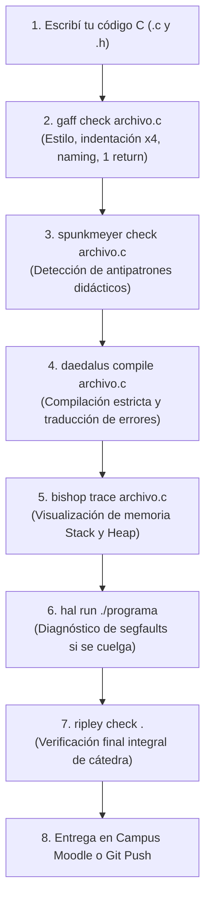

# Manual del Estudiante — Ecosistema de Herramientas P1
## Cátedra de Programación 1 — Universidad Nacional de Río Negro

Bienvenido al conjunto de herramientas pedagógicas de la cátedra. Estas herramientas están diseñadas para acompañarte en tu aprendizaje del lenguaje **C (C11 / GNU C)**, brindándote retroalimentación inmediata, explicaciones claras de errores del compilador y visualizadores de lo que sucede en la memoria de la computadora antes de que entregues tus trabajos prácticos.

---

## 1. Instalación y Puesta en Marcha

### 1.1 Requisitos Previos en Linux (Ubuntu, Debian, Fedora)

Asegurate de contar con el compilador GCC, GDB, Valgrind y `uv`:

**En Ubuntu / Debian:**
```bash
sudo apt update && sudo apt install -y build-essential gcc gdb valgrind clang-format git curl
```

**En Fedora / RHEL:**
```bash
sudo dnf install -y gcc gcc-c++ gdb valgrind clang-tools-extra git curl
```

**Instalar el gestor de paquetes `uv`:**
```bash
curl -LsSf https://astral.sh/uv/install.sh | sh
source ~/.bashrc  # o reiniciá tu terminal
```

### 1.2 Instalación en Windows
Si utilizás Windows, la cátedra provee el **Entorno Portable de Programación 1** (`entorno`), que incluye una terminal WezTerm, compilador GCC UCRT64 de 64 bits, GDB, `make`, Python con `uv`, VS Code Portable configurado y el lanzador de **`ripley`** (usa el zipapp `ripley.pyz` que descarga la instalación o, si no está, una instalación de `ripley` hecha con `uv`).

El resto de las herramientas de esta guía está pensado para Linux: varias dependen de programas que no existen en Windows (Valgrind, bubblewrap). En Windows usalas desde **WSL** con la modalidad Linux del [entorno](https://github.com/INGCOM-UNRN-P1/entorno) y seguí la sección 1.3.

### 1.3 Instalación de las Herramientas del Estudiante

Las herramientas se instalan **siempre desde su repositorio de GitHub**. No las instales por nombre desde PyPI: la mayoría de esos nombres pertenece en PyPI a otros proyectos y terminarías instalando un programa que no tiene nada que ver con la materia.

La forma más simple es con **`mother`**, el instalador del ecosistema: instala las herramientas del
perfil estudiante desde git y después verifica que funcionen.

```bash
uv tool install git+https://github.com/INGCOM-UNRN-P1/mother
mother instalar --perfil estudiante
mother doctor --perfil estudiante
```

Si preferís hacerlo a mano:

```bash
# Si clonaste el repositorio p1-tools (instala todas en modo editable):
./scripts/install_tools.sh

# O de forma individual, desde cada repositorio:
uv tool install git+https://github.com/INGCOM-UNRN-P1/daedalus
uv tool install git+https://github.com/INGCOM-UNRN-P1/gaff
uv tool install git+https://github.com/INGCOM-UNRN-P1/hal
uv tool install git+https://github.com/INGCOM-UNRN-P1/bishop
uv tool install git+https://github.com/INGCOM-UNRN-P1/spunkmeyer
uv tool install git+https://github.com/INGCOM-UNRN-P1/kaneda
uv tool install git+https://github.com/INGCOM-UNRN-P1/nostromo
uv tool install git+https://github.com/INGCOM-UNRN-P1/ripley
```

Para actualizarlas a la última versión: `mother actualizar --perfil estudiante` (o `uv tool upgrade --all`).

Para verificar que tu instalación esté en óptimas condiciones, ejecutá:
```bash
daedalus doctor
gaff doctor
ripley doctor
```
Si todas reportan `✓ OK`, tu estación de trabajo está lista.

---

## 2. El Flujo de Trabajo Cotidiano del Estudiante

Cuando resuelvas un ejercicio de una guía de trabajos prácticos, seguí este flujo secuencial para asegurar la calidad de tu entrega:



---

## 3. Guía Paso a Paso de las Herramientas

### 3.1 `gaff` — Linter de Estilo y Convenciones de Cátedra
`gaff` verifica que tu código cumpla las normas de estilo obligatorias de la materia:
* Indentación estricta en múltiplos de **4 espacios** (no tabuladores).
* Notación `snake_case` en variables y funciones (`mi_variable`, no `miVariable`).
* Prohibición de identificadores con números confusos o prefijos/sufijos numéricos redundantes (`num_1`, `a_n`, `x1`, `n`).
* **Máximo un único `return` por función**.
* Guardas de encabezado completas en archivos `.h`.

**Comandos:**
```bash
# Auditar un archivo
gaff check ejercicio1.c

# Auditar todos los fuentes de la carpeta actual
gaff check .

# Corregir automáticamente problemas menores de espaciado e indentación
gaff fix ejercicio1.c
```

---

### 3.2 `spunkmeyer` — Detector de Antipatrones Didácticos
`spunkmeyer` te alerta sobre malas prácticas conceptuales muy comunes en C que provocan errores sutiles:
* Control de archivos con `while (!feof(archivo))` (antipatrón: procesa el último registro dos veces).
* Casteo innecesario del retorno de `malloc()` (ej: `(int*)malloc(...)`).
* Verificación redundante de `NULL` antes de `free()` (la función `free(NULL)` es válida y no hace nada).
* Comparaciones booleanas redundantes como `if (resultado == true)`.
* Retorno de punteros a variables locales de la pila (punteros colgantes o dangling pointers).

**Comandos:**
```bash
spunkmeyer check ejercicio1.c
```

---

### 3.3 `daedalus` — Compilador con Banderas de Cátedra y Diagnóstico Pedagógico
La cátedra compila con parámetros exigentes:
`-std=c11 -Wall -Wextra -pedantic -Wconversion -Werror=implicit-function-declaration -Werror=return-type -g -O0`

(las dos últimas advertencias se tratan como error: llamar a una función sin declararla y olvidarse el `return` de una función no `void` no compilan).

`daedalus` compila tu código con estas mismas directivas y, si el compilador arroja errores técnicos incomprensibles, **te los traduce a explicaciones claras en español rioplatense**, indicándote exactamente qué significa el error y qué debes revisar.

**Comandos:**
```bash
# Compilar generando el binario (y ejecutarlo si compiló bien)
daedalus compile ejercicio1.c -o ejercicio1 && ./ejercicio1

# Traducir errores que ya tenés de otra compilación (desde un archivo o por tubería)
gcc ejercicio1.c 2> errores.txt; daedalus translate errores.txt
gcc ejercicio1.c 2>&1 | daedalus translate
```

---

### 3.4 `bishop` — Inspección Visual de Memoria (Stack y Heap)
¿Te cuesta entender cómo se acomodan las variables en la memoria o cómo apuntan los punteros? `bishop` dibuja el estado de la memoria en tu propia terminal:
* **Stack**: Cuadros de pila de cada función activa, argumentos recibidos, variables locales y sus direcciones.
* **Punteros**: Flechas y referencias exactas entre variables y los valores apuntados.
* **Heap**: Bloques reservados dinámicamente con `malloc()` / `calloc()`, tamaños asignados y detección de memoria que olvidaste liberar con `free()`.

**Comandos:**
```bash
# Trazar el comportamiento de memoria de un programa
bishop trace ejercicio1.c

# Ver punteros y marcos del Stack con flechas ASCII
bishop ascii ejercicio1.c

# Auditar solo el Heap (bloques activos y punteros huérfanos)
bishop heap ejercicio1.c
```

---

### 3.5 `hal` — Diagnóstico Pedagógico de Segfaults y Aborts
Si al ejecutar tu programa aparece el temido `Segmentation fault (core dumped)` o `Aborted`, `hal` te ayuda a encontrar la causa en segundos:
* Captura la señal fatal (`SIGSEGV`, `SIGABRT`, etc.).
* Desensambla y rastrea la línea exacta de tu archivo `.c` donde ocurrió el acceso indebido.
* Te explica en lenguaje humano si intentaste escribir en memoria de solo lectura, si accediste a un puntero `NULL` o no inicializado, o si te saliste de los límites de un arreglo.

**Comandos:**
```bash
# Ejecutar tu binario bajo el diagnóstico de hal (también acepta el .c y lo compila)
hal run ./ejercicio1

# O si tenés argumentos:
hal run ./ejercicio1 arg1 arg2
```

---

### 3.6 `kaneda` — Auditoría de Seguridad Estática
`kaneda` detecta vulnerabilidades y funciones prohibidas que ponen en riesgo tu programa:
* Uso de `gets()` (terminantemente prohibido por no tener límite de caracteres).
* Uso de `strcpy()` o `sprintf()` sin control de longitud de destino.
* Uso de `scanf("%s", buffer)` sin especificar el ancho máximo.
* Ejecución de llamadas al sistema riesgosas (`system()`, `popen()`, `fork`).

**Comandos:**
```bash
kaneda audit ejercicio1.c
```

---

### 3.7 `nostromo` — Ejecución en Sandbox Protegido
Cuando quieras probar tu código ante posibles lazos infinitos o consumos desmedidos de memoria:
`nostromo` ejecuta tu binario dentro de un contenedor aislado con cuotas estrictas de tiempo de CPU y memoria RAM.

**Comandos:**
```bash
# Ejecutar con límite de 2 segundos de CPU y 32 MB de RAM
nostromo run ./ejercicio1 --timeout 2.0 --memory 32

# Correr todos los casos de prueba de una carpeta (pares caso.in / caso.out)
nostromo test ./ejercicio1 casos/
```

---

### 3.8 `ripley` — Verificación Final de la Entrega
Antes de empaquetar tu entrega para Moodle o subir tu commit final a GitHub Classroom, ejecutá `ripley`:
`ripley` ejecuta en conjunto las reglas de cátedra (`0x0001h` a `0x000Fh`), la compilación estricta y los casos de prueba, entregándote un veredicto consolidado de tu trabajo.

**Comandos:**
```bash
# Evaluar la carpeta de tu entrega completa
ripley check .
```
Si `ripley` reporta que todas las verificaciones fueron superadas, podés enviar tu entrega con absoluta tranquilidad.

---

## 4. Tabla Resumen de Comandos para el Estudiante

| Necesidad | Herramienta | Comando Típico |
| :--- | :--- | :--- |
| Revisar estilo y convenciones | **`gaff`** | `gaff check archivo.c` |
| Auto-formatear espaciado | **`gaff`** | `gaff fix archivo.c` |
| Detectar antipatrones comunes | **`spunkmeyer`** | `spunkmeyer check archivo.c` |
| Compilar y entender errores | **`daedalus`** | `daedalus compile archivo.c -o programa` |
| Ver la memoria (Stack / Punteros) | **`bishop`** | `bishop trace archivo.c` |
| Diagnosticar un cuelgue / Segfault | **`hal`** | `hal run ./programa` |
| Auditar funciones peligrosas | **`kaneda`** | `kaneda audit archivo.c` |
| Probar límites y tiempos | **`nostromo`** | `nostromo run ./programa -t 2.0 -m 32` |
| Chequeo integral previo a entregar | **`ripley`** | `ripley check .` |

---

## 5. Solución de Problemas Frecuentes

* **"El comando daedalus (o gaff) no se encuentra"**:
  Asegurate de haber ejecutado `source ~/.bashrc` tras instalar `uv`, o ejecutá `./scripts/install_tools.sh`.
* **"gaff me marca error en return"**:
  En la cátedra se exige que cada función tenga un único punto de salida (`return`) al final. Evitá los retornos tempranos dentro de lazos o condicionales intermedias; usá variables de estado o banderas lógicas.
* **"daedalus me marca error: variable x no inicializada"**:
  En C las variables locales contienen basura si no las inicializás explícitamente al declararlas (ej: `int total = 0;`).
* **"bishop reporta fugas de memoria (memory leak)"**:
  Cada bloque que reserves con `malloc()` o `calloc()` debe tener su correspondiente `free()` antes de que termine la ejecución del programa.
